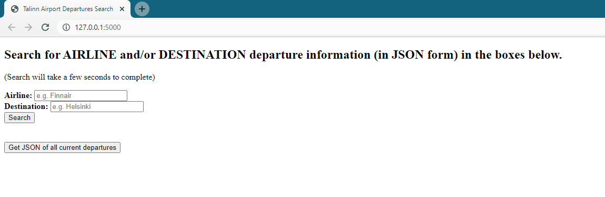

# FlightDeparturesFlaskApp
 Exercise to create a Flask app that extracts flight departure data from Talinn Airports website and serve curated data 
 via JSON format.

## Install requirements
This project contains a requirements fill which lists all dependencies for this project.

Run 
```
pip install -r /path/to/requirements.txt
``` 
in your virtual environment.


## Finding Finnair Departures
`finnairDeparturesExercise.py` is an application to determine departures by Finnair currently scheduled on Talinn 
Airport's website.

This application will export a ``finnairDepartures.json`` containing datetimes of all current Finnair departures 
(as well as their flight numbers) in the app's working directory.

Run by executing 
```
python finnairDeparturesExercise.py
``` 
in your virtual environment.


## Flask Server for Serving Departure Data
For the bonus portion of this exercise, I created a small Flask server to serve JSON information similar in the 
previous exercise, except it also allows for querying ``airline`` and ``destination`` information.

Run by executing 
```
flask run
``` 
in your virtual environment.

Then navigate to the server ``http://127.0.0.1:5000`` and the index should be visible.

You can search for Talinn Airport departures by searching for a specific airline and/or destination. If both fields are 
left blank when "Search" is clicked then no filter will be applied and the server will display a JSON-structured view
of all planned departures.

